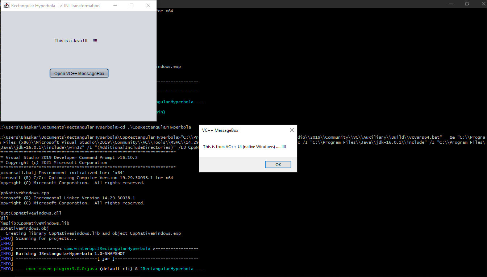

# RectangularHyperbola
Code to call into VC++ Win32 Message Box from Java Code using JNI

### What is a Rectangular Hyperbola, Anyways?
It is a Hyperbola (Conic Section --> Curve), with the beautiful property that any point lying on it (it's locus) satisfies the condition that the product of the Abscissa & Ordinate form a constant value ... i.e the Area of the Rectangle formed by Point (x,y) on the curve is a constant .... hence x*y=c which is it's characteristic equation, for instance!

### So why this name?
Primarily because the Project deals with Rectangular Windows as basic UI Components and it attempts to Transform the Java based GUI App. to a VC++ Message Box in Native Windows .... hence the term 'Rectangular' ... and the Transition deals with constant-ness hence the term Hyperbolic .... though this may sound like an exaggeration ... but highlights the fact that there's beautiful code written beneath the surface which seems to flaunt this amazing property never the less ....

### So how's this achieved?
Using JNI (Java Native Interface)

### Hmmmm .... what's JNI then?
Java Native Interface enables you to call into native code from any Java App. As simple as that.

### Wow! That's amazing .... How?
Let's take the example of this project. In Order to Call a VC++ Win32 based Message Box from Java, we leverage JNI.

### Okay, so What's there in this Project?
Two Projects basically ...
1. JRectangularHyperbola: The Java Maven based GUI Application that has a Form with a Label & Button.
2. CppRectangularHyperbola: The VC++ Win32 Dll which deals with display of the Message Box.

### Superb! So how does the integration work between these two?
Simple.
1. The Java Project defines the Basic Signature for the Message Box Invocation Method using the native keyword. (Java2Win Class)
2. This is used by ```javac -h``` option to generate a Header File.
3. The Generated Header File is then added to the VC++ Project as any other VC++ Header File.
4. That is then implemented in the Cpp File by including the header & Implementing the Function in VC++ to Call the now Native Message Box per se.
5. The Dll generated by the VC++ Project is used by the Java Executable to ```LoadLibrary()``` which basically loads the Dll in the Java Space using of course the JVM.
6. Then calling the VC++ Function is as simple as calling any other Java Method from the Java Application.
7. This invocation is tied to the Button click of the Java Application.

Hence, when you click the Button on Java UI, the VC++ Message Box Opens.

### Excellent! So how did you go about Building this?
Firstly, the Pre-Requisites that I had installed on my system were as follows:
1. Netbeans-12.4
2. Open JDK 16.0.1
3. Visual Studio 2019 with VC++ Desktop Workload.

And then, Here are the steps that I followed to make this work:
In Java:
1. Created a Maven Java Based Application using Netbeans-12.4.
2. Added the RHJFrame a Swing Component to it.
3. Added Button & Label to the Frame.
4. Added Java2Win Class for the native MessageBox Invoker Method Signature.

In JNI:
1. Generated the Header File using ```java -h``` command.

In VC+++:
1. Created a VC++ Win32 Desktop Blank Project in Visual Studio 2019 Community Edition.
2. Added the Header File in the step above to the Include folder within the Project.
3. Added the Corresponding Cpp File with the method Signature matching the header file JNI generated for me.
4. Implemented the MessageBoxW() method call in the above method that was added.
5. Set the Pragma to user32.lib to fix command line related errors.
6. Set Include Dirs ```java include & include\win32``` for the JNI in VC++ Project Settings.
7. Build the VC++ Project to generate the Dll.

In the Script:
1. Copy the Dll from above to the Java Project.
2. Execute the Java Project.

In the Java App:
1. Once the Window opens, click on the Button!
2. That brings up the VC++ Message Box for you!

That's It! <br>
You're all set with the JNI based Integration!!!! <br>

### That's Spectacular!!! So, where to, Next?
Just Download the Code. <br>
Set it up locally. <br>
Read it carefully. <br>
Play with it after understanding how it works! <br>
Try to extend it's capabilities .... be creative! <br>
Last but not the least, Run it & See it In Action!!!! <br>

### How do I do that?
Very Simple.
Just Run the ```./run.sh``` Command after cloning the Repository locally.

### That's Awesome!
Yup! And it's a wrap!!!
Here's a Snapshot to get you started ..... !!!!


Enjoy!!!! <br>
Happy Coding!!! <br>
See what Good you can do with Code!!! <br>
